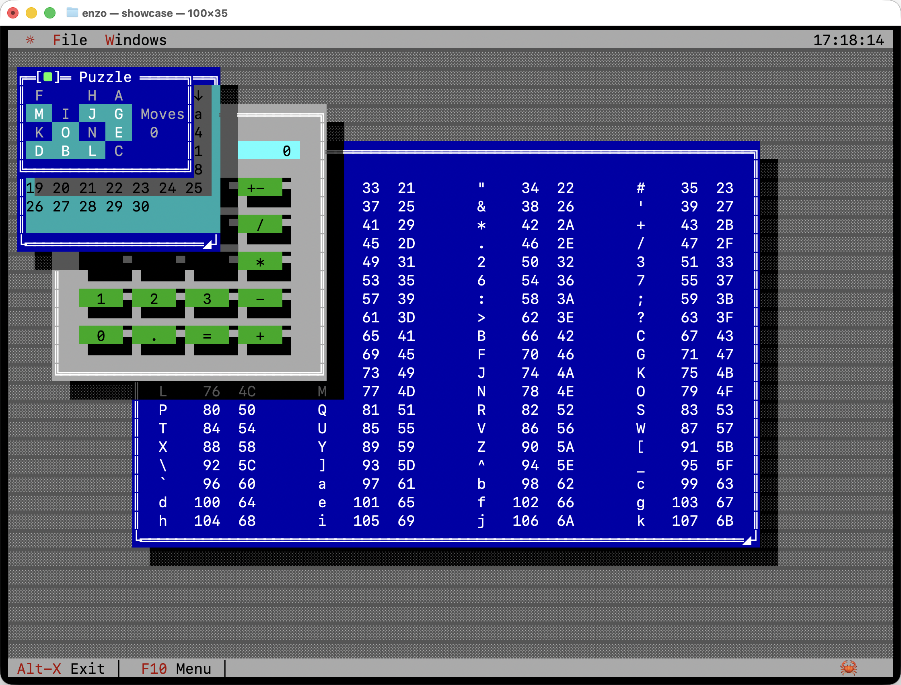
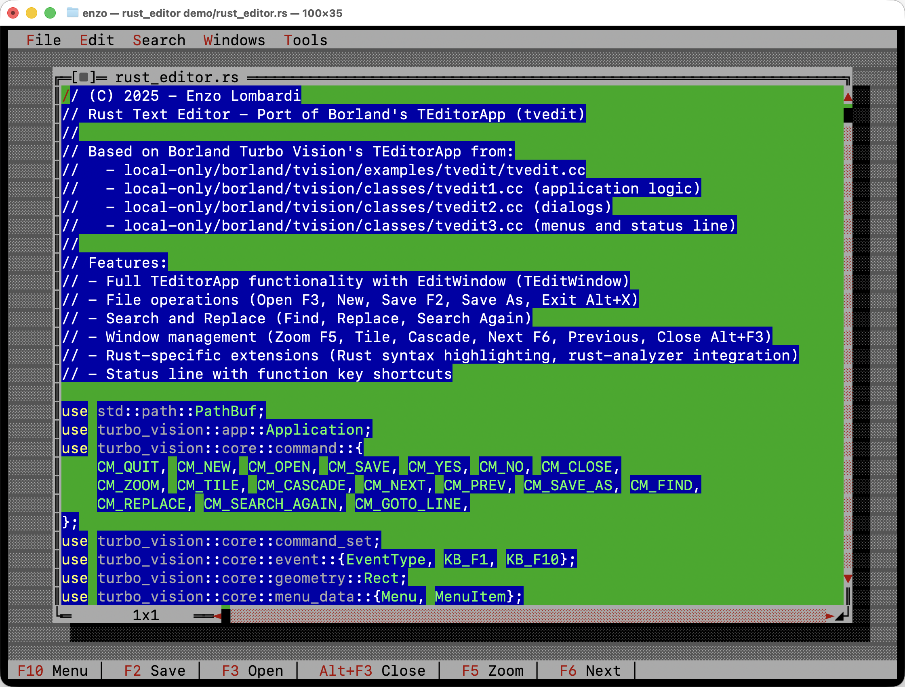
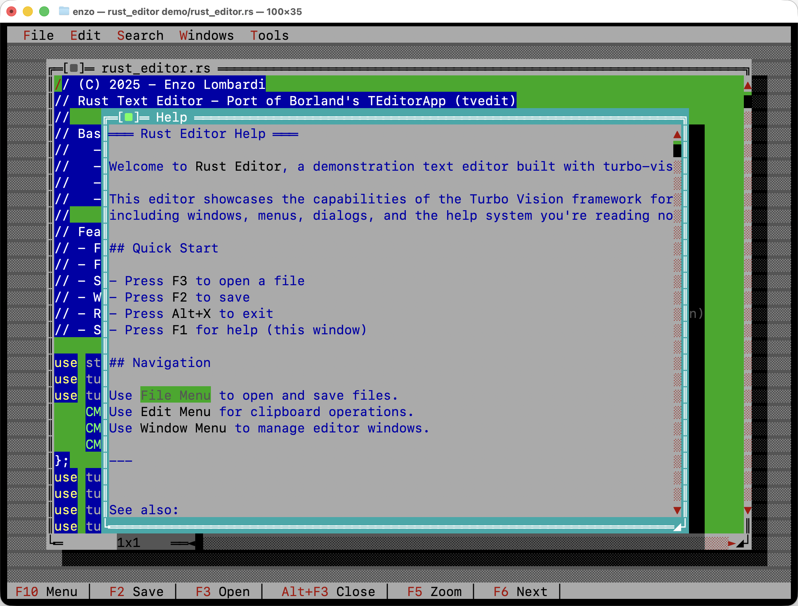
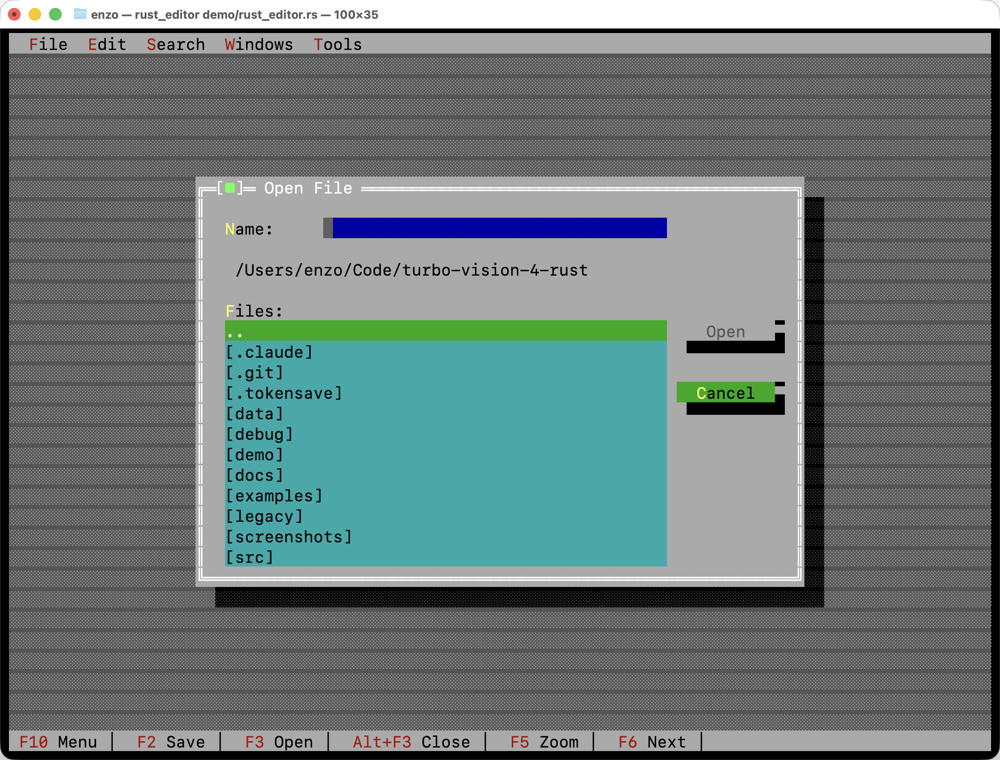

# Turbo Vision - Rust TUI Library


A Rust implementation of the classic Borland Turbo Vision text user interface framework.

**Version 1.0.0 - PRODUCTION READY** ✅

Based on
kloczek Borland Turbo Vision C++ port [here](https://github.com/kloczek/tvision)

Other C++ implementations:
- [Magiblot Turbo Vision for C++](https://github.com/magiblot/tvision)
- [Borland Original Turbo Vision 2.0.3 code](http://www.sigala.it/sergio/tvision/source/tv2orig.zip)

This port achieves **100% API parity** with
kloczek port of Borland Turbo Vision C++. All features from the original framework have been implemented. While the codebase is complete and production-ready, it may contain bugs. Please report any issues you encounter!

## Screenshots

### Showcase: Multiple Windows

The showcase demo with Calculator, Calendar, ASCII Table, and Puzzle windows demonstrating overlapping window management, z-ordering, and shadows.



### Code Editor

A full-featured text editor (`pascal_ide`) editing its own source code, with menu bar, status line, and scrollable editing area.



### Help Window

Context-sensitive help system (F1) with scrollable content, rendered over the editor window.



### File Chooser Dialog

The built-in file dialog with directory navigation, file list, and keyboard/mouse support.



## Features

- **Complete UI Component Set**: Windows, dialogs, buttons, input fields, menus, status bars, scrollbars
- **Z-Order Management**: Click any non-modal window to bring it to the front
- **Modal Dialog Support**: Modal dialogs block interaction with background windows
- **Borland-Accurate Styling**: Menu borders and shadows match original Borland Turbo Vision
- **Scrollable Views**: Built-in scrollbar support with keyboard navigation
- **Text Viewer**: Ready-to-use scrollable text viewer with line numbers
- **Event-Driven Architecture**:
  - Three-phase event processing (PreProcess → Focused → PostProcess)
  - Event re-queuing for deferred processing
  - Owner-aware broadcast system to prevent echo back to sender
- **Mouse Support**: Full mouse support for buttons, menus, status bar, dialog close buttons, scroll wheel, and double-click detection
- **Window Dragging and Resizing**: Drag windows by title bar, resize by bottom-right corner
- **Flexible Layout System**: Geometry primitives with absolute and relative positioning
- **Color Support**: 16-color palette with Borland-accurate attribute system and context-aware remapping
- **Cross-Platform**: Built on crossterm for wide terminal compatibility
- **SSH Support**: Optional SSH backend to serve TUI applications over SSH connections
- **Modal Dialogs**: Built-in support for modal dialog execution
- **Focus Management**: Tab navigation and keyboard shortcuts
- **ANSI Dump**: Debug UI by dumping screen/views to ANSI text files (F12 for full screen, Shift+F12 for active view, with flash effect)

## Quick Start

```rust
use turbo_vision::prelude::*;

fn main() -> turbo_vision::core::error::Result<()> {
    // Create a window
    let mut dialog = turbo_vision::views::dialog::DialogBuilder::new().bounds(Rect::new(10, 5, 50, 15)).title("My First Dialog").build();

    // Create a button and add it to the window
    let button = turbo_vision::views::button::Button::new(Rect::new(26, 6, 36, 8), "Quit", turbo_vision::core::command::CM_OK, true);
    dialog.add(Box::new(button));

    // Create the application and add the dialog to its desktop
    let mut app = Application::new()?;
    app.desktop.add(Box::new(dialog));

    // Event loop
    app.running = true;
    while app.running {
        app.desktop.draw(&mut app.terminal);
        app.terminal.flush()?;
        if let Ok(Some(mut event)) = app.terminal.poll_event(std::time::Duration::from_millis(50)) {
            app.desktop.handle_event(&mut event);
            if event.command == CM_OK {
                // Handle button click
                app.running = false;
            }
        }
    }
    Ok(())
}
```

**Tip**: Press F12 at any time to capture full screen to `screen-dump.txt`, or F11 to capture active window/dialog to `active-view-dump.txt` - both with a visual flash effect for debugging!

## Palette System

The color palette system accurately replicates Borland Turbo Vision's behavior:

- **Context-Aware Remapping**: Views automatically remap colors based on their container (Dialog, Window, or Desktop)
- **Owner Type Support**: Each view tracks its owner type for correct palette inheritance
- **Borland-Accurate Colors**: All UI elements (menus, buttons, labels, dialogs) match original Borland colors
- **Runtime Customization**: Change the entire application palette at runtime with `app.set_palette()` for custom themes

The palette system uses a three-level mapping chain:
1. View palette (e.g., Button, Label) → indices 1-31
2. Container palette (Dialog/Window) → remaps to indices 32-63
3. Application palette → final RGB colors

### Custom Palettes and Theming

You can customize the entire application palette at runtime to create custom themes:

```rust
// Create a custom palette (63 bytes, each encoding foreground << 4 | background)
let dark_palette = vec![/* 63 color bytes */];

// Set the palette - redraw happens automatically!
app.set_palette(Some(dark_palette));

// Reset to default Borland palette
app.set_palette(None);
```

See `examples/palette_themes_demo.rs` for a complete example with multiple themes.

## Module Overview

- **core**: Fundamental types (geometry, events, drawing, colors)
- **terminal**: Terminal I/O abstraction layer
- **views**: UI components (dialogs, buttons, menus, etc.)
- **app**: Application framework and event loop

## Documentation

This project includes extensive documentation for different audiences and use cases. Here's a recommended reading order based on your goals:

### 🚀 New to Turbo Vision? Start Here

If you're new to Turbo Vision frameworks, follow this path:

1. **Quick Start** (above) - Get a minimal example running
2. **[Examples Overview](examples/README.md)** - Browse 30+ working examples
   ```bash
   cargo run --example showcase    # Comprehensive feature showcase
   cargo run --bin pascal_ide     # Full-featured text editor
   ```
3. **[User Guide - Chapter 1](docs/user-guide/Chapter-01-Stepping-into-Turbo-Vision.md)** - Learn the basics
4. **[User Guide - Chapter 2](docs/user-guide/Chapter-02-Responding-to-Commands.md)** - Handle events and commands
5. **[User Guide - Chapter 3](docs/user-guide/Chapter-03-Adding-Windows.md)** - Create your first window

**Continue with**: Chapters 4-18 in the [User Guide](docs/user-guide/) for comprehensive coverage of all features.

### 🎯 Building Your First App

For practical application development:

1. **[Custom Application Example](docs/CUSTOM-APPLICATION-RUST-EXAMPLE.md)** - Complete walkthrough
2. **[Biorhythm Calculator Tutorial](docs/BIORHYTHM-CALCULATOR-TUTORIAL.md)** - Build a real app step-by-step
3. **[examples/showcase.rs](examples/showcase.rs)** - Study the comprehensive demo
4. **[pascal_ide source](demo/pascal_ide.rs)** - See a production-ready editor

### 🔧 Coming from Borland/C++ Turbo Vision?

If you're familiar with Borland Turbo Vision:

1. **[Architecture Overview](docs/user-guide/Chapter-07-Architecture-Overview.md)** - Understand Rust adaptations
2. **[Rust Implementation Reference](docs/RUST-IMPLEMENTATION-REFERENCE.md)** - Technical details
3. **[Turbo Vision Design](docs/TURBO-VISION-DESIGN.md)** - Complete design document

**Key Differences**: The Rust port uses composition over inheritance, but maintains the same event loop patterns, drawing system, and API structure as Borland's original.

### 📚 Feature-Specific Guides

When you need specific functionality:

- **Palette & Colors**: [Palette System](docs/PALETTE-SYSTEM.md), [Borland Palette Chart](docs/BORLAND-PALETTE-CHART.md), [Chapter 14](docs/user-guide/Chapter-14-Palettes-and-Color-Selection.md)
- **Event Handling**: [Chapter 9 - Event-Driven Programming](docs/user-guide/Chapter-09-Event-Driven-Programming.md)
- **Forms & Input**: [Chapter 5 - Data Entry Forms](docs/user-guide/Chapter-05-Creating-Data-Entry-Forms.md), [Chapter 13 - Validation](docs/user-guide/Chapter-13-Data-Validation.md)
- **Text Editing**: [Chapter 15 - Editor and Text Views](docs/user-guide/Chapter-15-Editor-and-Text-Views.md)
- **Collections & Lists**: [Chapter 6 - Managing Data Collections](docs/user-guide/Chapter-06-Managing-Data-Collections.md)
- **Persistence**: [Serialization Guide](docs/SERIALIZATION-PERSISTENCE.md), [Quick Reference](docs/SERIALIZATION-QUICK-REFERENCE.md)
- **Application Structure**: [Chapter 10 - Application Objects](docs/user-guide/Chapter-10-Application-Objects.md)
- **Windows & Dialogs**: [Chapter 11 - Window and Dialog Box Objects](docs/user-guide/Chapter-11-Window-and-Dialog-Box-Objects.md)

### 📖 API Reference

For API lookups and function signatures:

- **[Documentation Index](docs/DOCUMENTATION-INDEX.md)** - Master index of all documentation
- **[Rust API Catalog](docs/RUST-API-CATALOG.md)** - Complete API listing
- **[API Catalog Index](docs/RUST-API-CATALOGUE-INDEX.md)** - Quick reference guide
- **Inline Docs**: Run `cargo doc --open` for generated documentation

### 🛠️ Contributing to the Project

If you want to modify or extend the codebase:

1. **[Rust Coding Guidelines](docs/RUST-CODING-GUIDELINES.md)** - Code style and best practices
2. **[Chapter 8 - Views and Groups](docs/user-guide/Chapter-08-Views-and-Groups.md)** - Understanding the view hierarchy
3. Study existing tests in `src/views/*/tests` modules

### 📂 Complete Documentation Structure

```
docs/
├── DOCUMENTATION-INDEX.md              # Master index
├── RUST-CODING-GUIDELINES.md          # Code style guide
├── CUSTOM-APPLICATION-RUST-EXAMPLE.md  # Complete app walkthrough
├── BIORHYTHM-CALCULATOR-TUTORIAL.md    # Step-by-step tutorial
├── PALETTE-SYSTEM.md                   # Color system explained
├── BORLAND-PALETTE-CHART.md            # Color reference
├── RUST-API-CATALOG.md                 # API reference
├── TURBO-VISION-DESIGN.md              # Complete design document
├── SERIALIZATION-PERSISTENCE.md         # Saving/loading data
└── user-guide/                         # 18-chapter comprehensive guide
    ├── Chapter-01-Stepping-into-Turbo-Vision.md
    ├── Chapter-02-Responding-to-Commands.md
    ├── ... (Chapters 3-17)
    └── Chapter-18-Resources.md

examples/
├── README.md                           # Examples index with descriptions
├── showcase.rs                         # Comprehensive demo
├── biorhythm.rs                        # Complete calculator app
└── ... (30+ more examples)

demo/
└── pascal_ide.rs                      # Production text editor
```

### 🔗 Quick Links

- **Start Coding**: [Quick Start](#quick-start) → [Examples](examples/README.md)
- **Learn Concepts**: [User Guide Chapter 1](docs/user-guide/Chapter-01-Stepping-into-Turbo-Vision.md)
- **Build an App**: [Custom Application Example](docs/CUSTOM-APPLICATION-RUST-EXAMPLE.md)
- **Get Help**: [Documentation Index](docs/DOCUMENTATION-INDEX.md)
- **Report Issues**: [GitHub Issues](https://github.com/aovestdipaperino/turbo-vision-4-rust/issues)


## Status

Currently implements:
- ✅ Core drawing and event system
- ✅ Dialog boxes with frames and close buttons
- ✅ Buttons with keyboard shortcuts
- ✅ Static text labels (with centered text support)
- ✅ Input fields
- ✅ Menu bar with dropdowns and keyboard shortcut display
- ✅ Status line with hot spots (hover highlighting, context-sensitive hints)
- ✅ Desktop manager
- ✅ Scrollbars (vertical and horizontal)
- ✅ Scroller base class for scrollable views
- ✅ Indicator (position display)
- ✅ Text viewer with scrolling
- ✅ CheckBoxes
- ✅ RadioButtons
- ✅ ListBoxes
- ✅ Memo (multi-line text editor)
- ✅ Mouse support (buttons, menus, status bar, close buttons, hover effects, listbox clicks, scroll wheel, double-click detection)
- ✅ Window dragging and resizing (drag by title bar, resize from bottom-right corner with minimum size constraints)
- ✅ Window closing (non-modal windows close with close button, modal dialogs convert to cancel)
- ✅ File Dialog (fully functional with mouse/keyboard support and directory navigation)
- ✅ ANSI Dump for debugging (dump screen/views to text files with colors)
- ✅ Input Validators (FilterValidator, RangeValidator with hex/octal, LookupValidator)
- ✅ Editor with search/replace and file I/O (load_file, save_file, save_as)
- ✅ EditWindow (ready-to-use editor window wrapper)
- ✅ OS Clipboard integration (cross-platform with arboard)
- ✅ Help System (markdown-based with HelpFile, HelpViewer, HelpWindow, HelpContext)
- ✅ SSH TUI Bridge (optional feature for serving TUI apps over SSH)

## SSH Support

Turbo Vision can serve TUI applications over SSH connections, enabling remote terminal access to your application. This is useful for admin consoles, monitoring dashboards, and tools that need to be accessed remotely.

### Enabling SSH Support

SSH support is behind a feature flag. Enable it in your `Cargo.toml`:

```toml
[dependencies]
turbo-vision = { version = "1.0", features = ["ssh"] }
```

Or build with the feature:

```bash
cargo build --features ssh
```

### Quick Example

```rust
use turbo_vision::prelude::*;
use turbo_vision::terminal::{Backend, SshBackend, SshSessionBuilder};
use turbo_vision::ssh::{SshServer, SshServerConfig};
use std::sync::Arc;

#[tokio::main]
async fn main() -> Result<(), Box<dyn std::error::Error>> {
    let config = SshServerConfig::default();
    let server = SshServer::new(config)?;

    server.run("0.0.0.0:2222", |backend| {
        // Create Terminal with SSH backend
        let terminal = Terminal::with_backend(backend).unwrap();
        run_your_tui_app(terminal);
    }).await?;

    Ok(())
}
```

### Running the Example

```bash
# Start the SSH server
cargo run --example ssh_server --features ssh

# Connect from another terminal
ssh -p 2222 user@localhost
# Password: any (accepts any password in the example)
```

### Architecture

The SSH support uses a Backend trait abstraction:

- **Backend trait**: Abstracts terminal I/O operations
- **CrosstermBackend**: Default implementation for local terminals
- **SshBackend**: Implementation for SSH channel I/O
- **InputParser**: Converts raw terminal bytes to turbo-vision events

This allows the same TUI application to run locally or over SSH with no code changes.

## Architecture

This implementation closely follows Borland Turbo Vision's architecture, adapted for Rust:

- **Event Loop**: Located in `Group` (matching Borland's `TGroup::execute()`), not in individual views
- **Modal Dialogs**: Use Borland's `endModal()` pattern to exit event loops
- **View Hierarchy**: Composition-based design (`Window` contains `Group`, `Dialog` wraps `Window`)
- **Drawing**: Event-driven redraws with Borland's `drawUnderRect` pattern for efficient updates
- **Event System**:
  - Three-phase processing (PreProcess → Focused → PostProcess) matching Borland's `TGroup::handleEvent()`
  - Event re-queuing via `Terminal::put_event()` matching Borland's `TProgram::putEvent()`
  - Owner-aware broadcasts via `Group::broadcast()` matching Borland's `message(owner, ...)` pattern

## Project Statistics

```
===============================================================================
 Language            Files        Lines         Code     Comments       Blanks
===============================================================================
 Rust                  125        37315        28029         3557         5729
 |- Markdown           102         4695          332         3604          759
 (Total)                          42010        28361         7161         6488
===============================================================================
```

Generated with [tokei](https://github.com/XAMPPRocky/tokei) - includes inline documentation

**226 unit tests** - all passing ✅

## License

MIT License - see [LICENSE](LICENSE) file for details.

